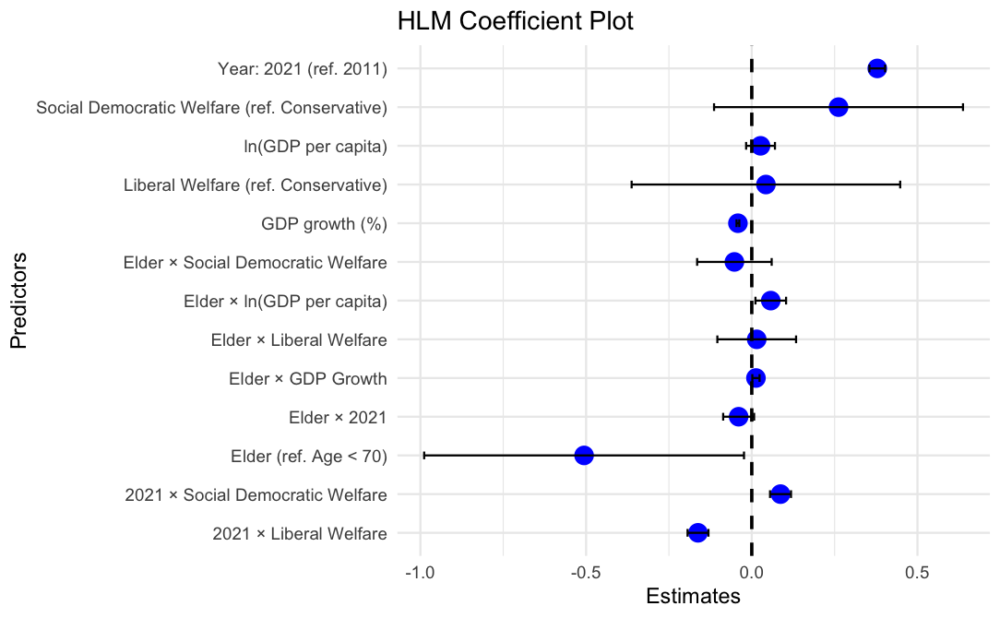
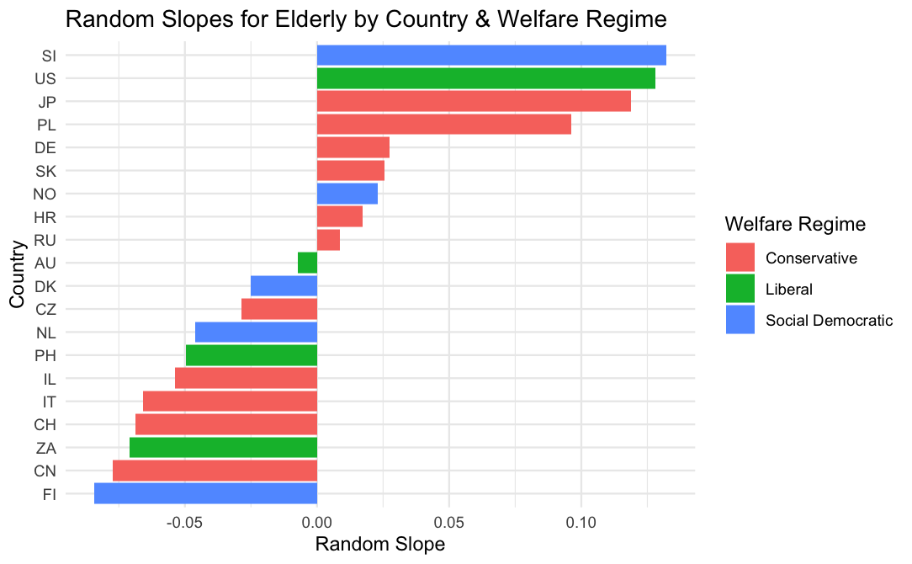

# **Age and Health Inequality: A Cross-National Hierarchical Analysis**

This repository presents the findings of a comparative study on **age-based health inequality across welfare regimes**, using **multilevel modeling (HLM)** and ISSP survey data from 20 countries (2011 & 2021). The project focuses on how older adults evaluate healthcare systems, and whether such evaluations can be systematically explained by welfare state typologies.

> 📘 **Course Project**  
> This project was submitted as the final report for the course *Research Methods and Data Analysis* (Fall 2024), offered to students in the **Department of Sociology**, **National Taiwan University**.

## 🧠 Overview

While health inequality has long been studied through the lenses of class, gender, and race, **age as a structural axis of inequality** remains underexplored. This study examines whether older adults systematically rate healthcare systems more negatively than younger cohorts—and whether **welfare regimes** (liberal, conservative, social-democratic) explain this gap.

Key features of this research:
- Focus on **structural ageism** rather than individual-level discrimination.
- Use of **cross-national survey data** (ISSP 2011 & 2021).
- Application of **Hierarchical Linear Modeling (HLM)** to account for country-level variation.

## 📊 Methods

- **Data**: International Social Survey Programme (ISSP) 2011 & 2021 waves  
- **Sample**: 62,614 respondents from 20 countries  
- **Dependent variables**:  
  1. Confidence in the healthcare system  
  2. Satisfaction with the healthcare system  
  3. Evaluation of system efficiency  
- **Key independent variable**: Age group (≥70 vs. <70)  
- **Control variables**: Physical & mental health, chronic illness, income, survey year  
- **Country-level controls**: Welfare regime, GDP per capita, GDP growth  

### Modeling Strategy
- Multilevel linear regression using `lme4` and `lmerTest` in R  
- Model includes both fixed and random slopes for age group  
- ICC confirms the need for hierarchical modeling (20% of variance at country level)

## 📈 Main Findings

- Older adults tend to rate healthcare systems **significantly lower** than younger adults, even after controlling for health and income.
- **Economic indicators** (e.g. GDP growth) explain much of the initial age gap.
- **Welfare regime types** do **not** consistently explain variation in elderly evaluations across countries.
- High **within-regime heterogeneity** suggests national context matters more than regime classification.

> 🔍 *Contrary to expectations, some social-democratic countries show greater age gaps than liberal ones.*

## 📉 Model Outputs

### 🔹 Fixed Effects (Coefficients)

  

<em>Coefficient estimates from the full model. After controlling for health, income, and GDP factors, older adults (≥70) show significantly lower evaluations of the healthcare system.</em>

---

### 🔹 Random Slopes for Age Group

  

<em>Random slopes by country: the age gap in healthcare system evaluations varies widely across nations, with no clear pattern by welfare regime.</em>

## 📎 Notes

- No raw ISSP data or full report is included here.  
- This repository only documents the **research design, modeling strategy, and core findings**.  
- For inquiries, please contact the author directly.

## 💻 Environment

- **Language**: R  
- **R Version**: 4.4.1  
- **Key packages**: `lme4`, `lmerTest`, `ggplot2`

## 📜 License

This repository is shared for academic and educational purposes only.  
Please do not cite or redistribute without permission.

<a property="dct:title" rel="cc:attributionURL" href="https://github.com/lauzhenyi/age_inequality">Age and Health Inequality: A Cross-National and Longitudinal Perspective</a> by <a rel="cc:attributionURL dct:creator" property="cc:attributionName" href="https://github.com/lauzhenyi">Lau Zhen Yi</a> is licensed under <a href="https://creativecommons.org/licenses/by-nc-nd/4.0/?ref=chooser-v1" target="_blank" rel="license noopener noreferrer" style="display:inline-block;">Creative Commons Attribution-NonCommercial-NoDerivatives 4.0 International</a>

